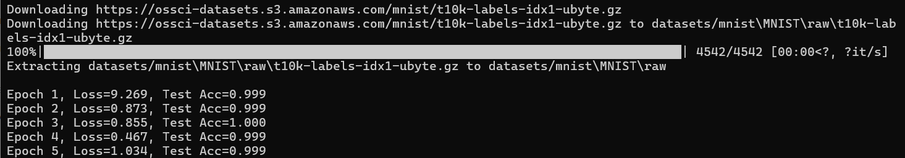

## MNIST Prototype

### CNN

Purpose:
- Validate training pipeline
- Confirm binary classification setup
- Establish classical baseline

Model:
- Simple CNN (2 conv layers, 2 FC layers)
- 5 epochs

Dataset:
- MNIST digits 0 vs 1
- Full data used for prototype

Observations:
- Fast convergence
- High accuracy (>99%) as expected
- Confirms pipeline correctness

Next:
- Implement Quantum model on same data
- Reduce data fractions (10%, 25%)
