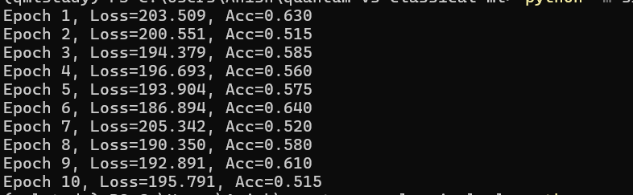

## MNIST Prototype

First create conda environment -> activate environment -> conda install pytorch and torchvision -> pip install requirements.txt

### CNN

run using :
> python -m src.train.train_cnn

Purpose:
- Validate training pipeline
- Confirm binary classification setup
- Establish classical baseline

Model:
- Simple CNN (2 conv layers, 2 FC layers)
- 5 epoch

Dataset:
- MNIST digits 0 vs 1
- Full data used for prototype

Observations:
- Fast convergence
- High accuracy (>99%) as expected
- Confirms pipeline correctness

---

### QML

run using :
> python -m src.train.train_qml

Model:
- Variational Quantum Classifier (4 qubits)
- Angle encoding + entangling layers

Dataset:
- MNIST (0 vs 1)
- 200 samples (for simulator efficiency)

Observations:
- Slower training than CNN
- Lower accuracy but stable convergence (50% to 60%). This accuracy isn't bad and is expected from the simple setup.
- Is the low accuracy bad? no, if qml was better than cnn wouldn't it already have replaced traditional ml.
- Confirms feasibility of QML pipeline

Limitations:
- Heavy dimensionality reduction
- Simulator-only

> Environment Note (QML)
> - PennyLane 0.35.1 requires autoray <= 0.6.x
> - autoray 0.8+ causes import failure due to missing NumpyMimic
> - Environment pinned for reproducibility
> - PennyLane requires float64 tensors
> - Output and target shapes must match explicitly
> - MSE loss used for expectation-value regression

Next:
- Reduce data fractions (10%, 25%)
